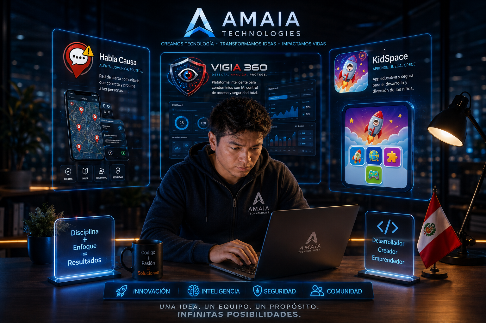

# 👋 Hola, soy Carlitos R.

### 💻 Freelancer en Programación & Desarrollo de Software

🚀 Founder @ AMAIA Technologies  
💻 Software Developer  
📱 Mobile & Web Development  
🤖 AI • Automation • Cloud  
🇵🇪 Building technology from Peru

---

  

## 🚀 Sobre mí

Soy **Carlitos R.**, desarrollador y creador de proyectos tecnológicos enfocados en transformar ideas en productos digitales.

Trabajo en el desarrollo de aplicaciones móviles, plataformas web, automatización, soluciones cloud e integración de inteligencia artificial.

Actualmente desarrollo diferentes productos tecnológicos bajo **AMAIA Technologies**, enfocados principalmente en seguridad, comunidad, educación y soluciones empresariales.
# 🚀 Mis proyectos

## 🚨 Habla Causa

Red de alerta comunitaria que permite reportar situaciones de riesgo y visualizar alertas geolocalizadas en tiempo real.

**Tecnologías:** Flutter • Firebase • Cloud Functions • Maps

---

## 🛡️ Vigia 360

Plataforma inteligente para la administración y seguridad de condominios.

Incluye control de vehículos, residentes, vigilantes, incidentes, evidencias, alertas preventivas y reportes.

**Tecnologías:** Web • Supabase • Cloud • Analytics

---

## 🚀 KidSpace

App de control parental que permite a los padres decidir qué aplicaciones pueden usar sus hijos, creando un entorno digital seguro, controlado y apropiado para niños.

**Enfoque:** Educación • Tecnología • control parental

---

## 🏢 AMAIA Technologies

Proyecto tecnológico desde donde desarrollo aplicaciones, plataformas web y soluciones digitales.
# 🧠 Tecnologías y habilidades

### 💻 Desarrollo

JavaScript • TypeScript • Dart • HTML • CSS • SQL

### 🌐 Web

React • Next.js • Tailwind CSS

### 📱 Mobile

Flutter • Android • Firebase

### ☁️ Backend & Cloud

Firebase • Supabase • Cloud Functions • Cloudflare

### 🛠️ Herramientas

Git • GitHub • VS Code • Codex

### 🤖 Intereses

Inteligencia Artificial • Automatización • SaaS • Cloud Computing • Ciberseguridad

---

  <b>AMAIA TECHNOLOGIES</b>

  Innovación • Inteligencia • Seguridad • Comunidad

  🚀 <b>Una idea. Un propósito. Infinitas posibilidades.</b>

**Innovación • Inteligencia • Seguridad • Comunidad**
